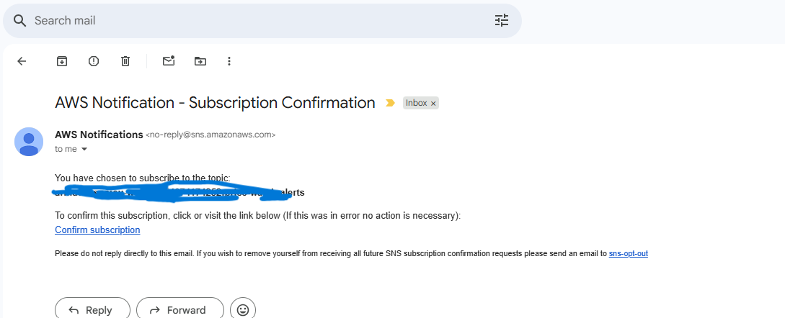

# AWS Data Pipeline (NBS Food Price Use Case)

⚡ **Recreate this AWS data pipeline in minutes using Terraform!**

This project provisions a modular AWS data pipeline using Terraform. Each AWS service lives in its own directory under `infrastructure/services`, so you can provision and manage them independently.

---
## 📖 Project Overview

### ⚙️ Architecture
 


* **HashiCorp Terraform (IaC Tool) →** Provisions all AWS resources in a modular way, ensuring reusability and consistency.

* **AWS S3** → Stores raw and processed data. Acts as the central data lake.

*  **AWS Lambda** → Runs ingestion logic ( fetching data and uploading to S3).

*  **AWS ECR** → Stores Docker images for data cleaning tasks.

*  **AWS ECS** → Runs containerized cleaning/transformation jobs.

*  **AWS Glue Crawler & Data Catalog** → Crawls processed data in S3 and creates a catalog for querying with Athena or other tools.

*  **Step Functions** → Orchestrates the workflow (ingestion → cleaning → cataloging).

*  **CloudWatch & SNS (Monitoring)** → Provides logging, monitoring, and notifications on pipeline execution.

*   **IAM Roles (Modules)** → Securely manages permissions for services to interact.


💡 All resources are modularized under infrastructure/services and infrastructure/modules. You can provision each one independently, and outputs from one service feed into the next.

## 🛠️ Prerequisites

* [Terraform](https://developer.hashicorp.com/terraform/downloads) (v1.x recommended)
* AWS CLI configured (`aws configure`)
* PowerShell (for running build scripts on Windows)
* Your ingestion script + cleaning script
* Docker
* Python
---

## 📂 Project Structure


```
aws-data-pipeline-terraform/
│   README.md
│
├───ecs/
│   ├───build_and_push.ps1
│   ├───clean_data.py
│   ├───Dockerfile
│   └───requirements.txt
│
├───lambda/
│   ├───build_lambda.ps1
│   ├───requirements.txt
│   ├───ingest_to_s3.py
│   └───lambda_function.py
│
└───infrastructure/
    ├───modules/
    │   └───<service_name>/
    │        ├───main.tf
    │        ├───variables.tf
    │        └───outputs.tf
    │
    └───services/
         └───<service_name>/
              ├───main.tf
              └───outputs.tf
```


IAM roles are defined in the **modules**, so you don’t need to configure them manually.


## ⚡ Quickstart Guide

### 1. Clone the repository

```bash
git clone https://github.com/zalihat/aws-data-pipeline-terraform.git 
cd aws-data-pipeline-terraform
```

---

### 2. Provision the S3 bucket

```bash
cd infrastructure/services/s3
```

* Open `main.tf` and change:

  * `region` → your AWS region
  * `s3_bucket_name` → your bucket name

Run:

```bash
terraform init
terraform plan
terraform apply
```

---

### 3. Provision the Lambda function

```bash
cd ../../lambda
```

* Replace `ingest_to_s3.py` with your **ingestion logic**.
* Edit `lambda_function.py` → update the `run_ingestion_logic` call for your use case.


Build the Lambda package (PowerShell):

```bash
.\build_lambda.ps1
```

This will:

* Create a build folder
* Update your ingestion code to use the S3 bucket you created (instead of hardcoding names).
* Install dependencies from `requirements.txt`
* Package everything into `lambda_package.zip`

Then deploy lambda function:

```bash
cd ../infrastructure/services/lambda_ingest
terraform init
terraform plan
terraform apply
```

---

### 4. Provision the ECR repository

```bash
cd ../../services/ecr
terraform init
terraform plan
terraform apply
```

---

### 5. Provision ECS

Back at the project root, go to ECS:

```bash
cd ../../ecs
```

Here you’ll find:

* `Dockerfile`
* `clean_data.py` (example cleaning logic)
* `build_and_push.ps1`

Run the build script:

```bash
.\build_and_push.ps1
```

This will:

* Automatically set the bucket name from Step 2
* Get the ECR repo URL from Step 4
* Build + push the Docker image

Provision ECS resources:

```bash
cd ../infrastructure/services/ecs
terraform init
terraform plan
terraform apply
```

This creates:

* VPC
* Subnets
* Security groups
* Task definitions

---

### 6. Provision Glue (Crawler + Catalog)

```bash
cd ../glue
terraform init
terraform plan
terraform apply
```

✅ This sets up a Glue **crawler** and a **data catalog** for your processed data.

---

### 7. Provision Step Functions

```bash
cd ../stepfunction
terraform init
terraform plan
terraform apply
```

✅ This orchestrates your Lambda-based ingestion pipeline.
Once the Step Function is provisioned, it serves as the orchestrator of your pipeline:

* It first triggers the Lambda ingestion function.

* Then it runs the ECS task to clean and transform the data.

* Finally, it updates the Glue Crawler so the catalog stays fresh.

#### **Running the Pipeline**

You have two options:

1. Manual Execution

    * Go to the AWS Step Functions Console.
    * Select your state machine.

    * Click Start Execution.

    * The entire pipeline will run end-to-end.

2. Scheduled Execution

    * You can attach a CloudWatch Event rule (or EventBridge schedule) to trigger the state machine at fixed intervals (e.g., daily, hourly).

**Example State Machine**

This is what the state machine looks like after a successful execution

 


---

### 8. Provision Monitoring (CloudWatch + SNS)

```bash
cd ../monitoring
terraform init
terraform plan
terraform apply
```

✅ This sets up **CloudWatch** for logs + metrics 
 

and **SNS** for pipeline notifications.




---

## 📊 Example Flow

1. Raw data lands in **S3**
2. **Lambda** ingests → Step Functions orchestrate
3. **ECR** holds Docker image → ECS runs containerized job
4. **CloudWatch** logs ECS outputs
5. **Glue Crawler + Catalog** auto-discover schemas
6. **SNS** sends notifications

---

💡 *All components are linked by Terraform outputs → inputs, so you don’t need to hardcode names. Just update your ingestion + cleaning logic, and the pipeline wires itself together.*
